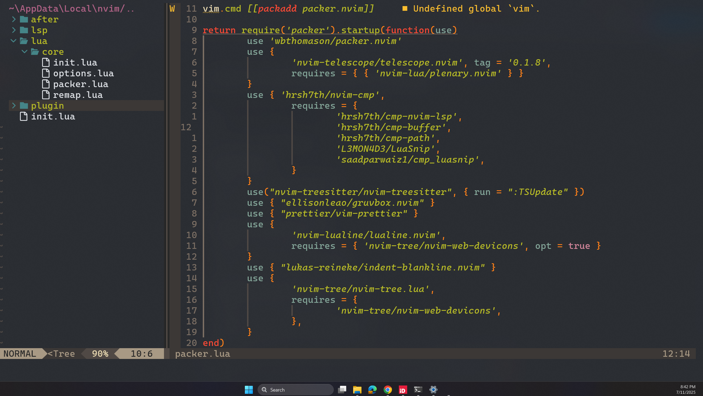

# My Nvim Configuration

This repository contains the code for my nvim configuration. I tried to make it as minimal as possible.

## Plugins

I use packer as a plugin manager, just because...

Here is the list of plugins which are setup in the `after/plugin` directory:

- `nvim-telescope/telescope.nvim` for fuzzy finding.
- `hrsh7th/nvim-cmp` for intellisense, code suggestions and completions.
- `nvim-lualine/lualine.nvim` for an awesome statusline.
- `nvim-treesitter/nvim-treesitter` for syntax highlighting.
- `lukas-reineke/indent-blankline.nvim` for indentation lines.
- `nvim-tree/nvim-tree.lua` for a file tree.

and that's pretty much it.

## LSP

With `v0.11`, lsp can now be configured natively. Here is the list of the language servers which I setup (for now):

- `lua_ls` for lua.
- `rust_analyzer` for rust.
- `jedi language server` for python.
